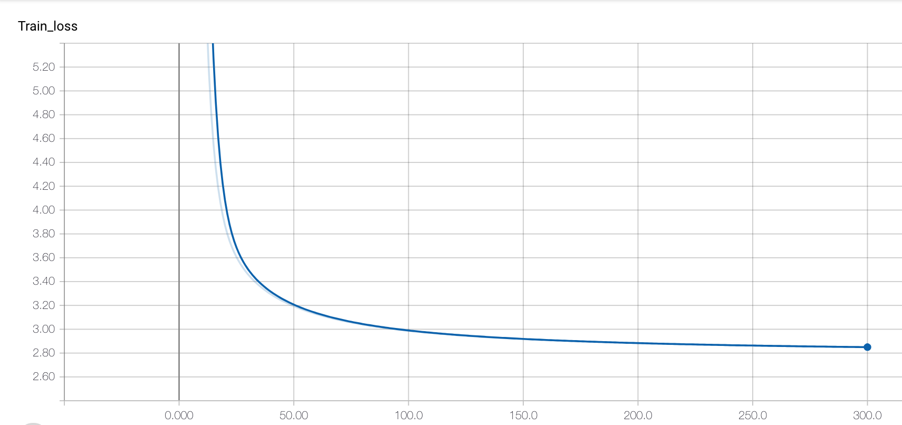
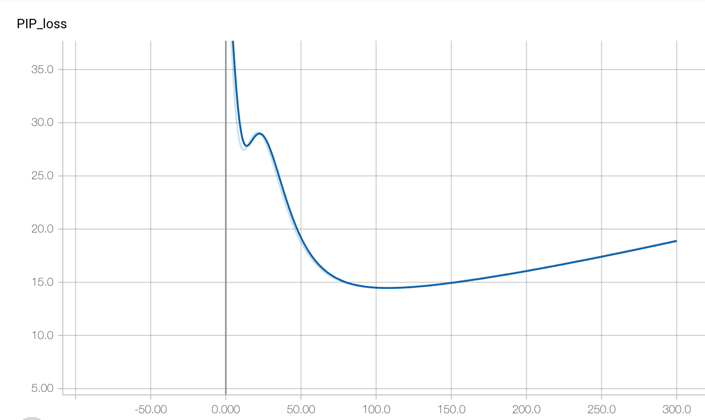
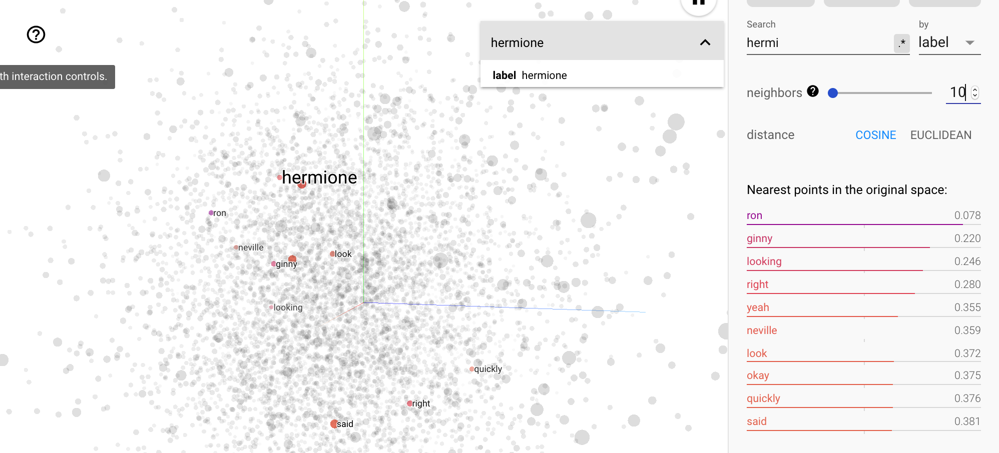
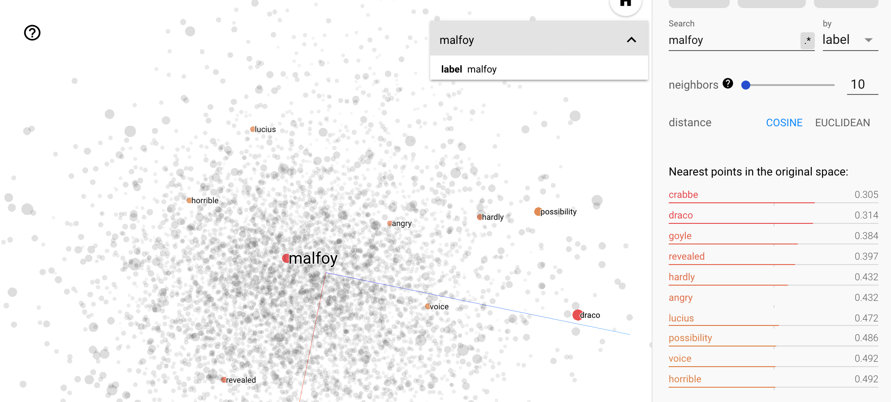

# sgns_pytorch
Pytorch implementation of Skip-gram Negative Sampling and RNN-based SGNS. Sample dataset is Harry Potter series. The quality of the embedding is monitored with PIP loss with SPPMI matrix. 

# Requirements
- Pytorch 1.0
- tensorboardX
- nltk

# Data parallel
```
python trainer.py --multi-gpu --num-gpu 4
```

# Distributed training
```
python trainer.py --multi-node --backend nccl --init-method nccl://master.ip.address --rank 0 --world-size 4
```

# Experiments
| model | node | sync  | gpu | embedding | batch    | time/epoch | lowest PIP loss |
|-------|------|-------|-----|-----------|----------|------------|-----------------|
| sgns  | 4    | async | 4   | 200       | 8192 * 4 | 46.5       | X               |
| sgns  | 4    | sync  | 4   | 200       | 8192 * 4 | 52.79      | 193.6           |
| sgns  | 4    | sync  | 4   | 200       | 1024 * 4 | 394        | X               |
| sgns  | 4    | sync  | 4   | 50        | 8192 * 4 | 16.93      | 44.12           |
| sgns  | 4    | sync  | 4   | 50        | 1024 * 4 | 93.81      | 44.21           |
| sgns  | 1    | -     | 1   | 200       | 8192     | 28.6       | 129.3           |
| sgns  | 1    | -     | 1   | 200       | 1024     | 34.1       | 123.6           |
| sgns  | 1    | -     | 1   | 50        | 8192     | 29         | 15.1885         |
| sgns  | 1    | -     | 1   | 50        | 1024     | 21.6       | 14.52           |
| sgns  | 1    | -     | 4   | 200       | 8192 * 4 | 24.1       | ing             |
| sgns  | 1    | -     | 4   | 200       | 1024 * 4 | 25.37      | 129.6           |
| sgns  | 1    | -     | 4   | 50        | 8192 * 4 | 21.28      | ing             |
| sgns  | 1    | -     | 4   | 50        | 1024 * 4 | 24.08      | 15.44           |
| rnn   | 1    | -     | 1   | 200       | 1024     | 1133.9     | 1.11            |

# Results
## Train loss
{: .center-image width="50px"}

## PIP loss
{: .center-image width="50px"}

## Example 1
{: .center-image width="50px"}

## Example 2
{: .center-image width="50px"}
